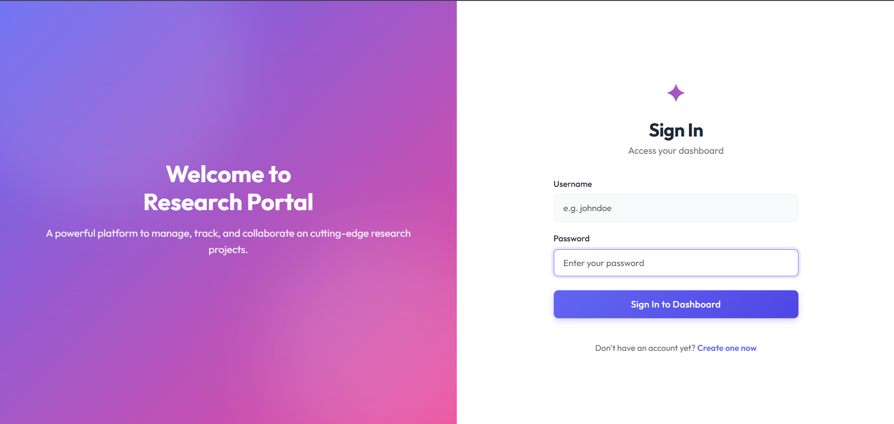
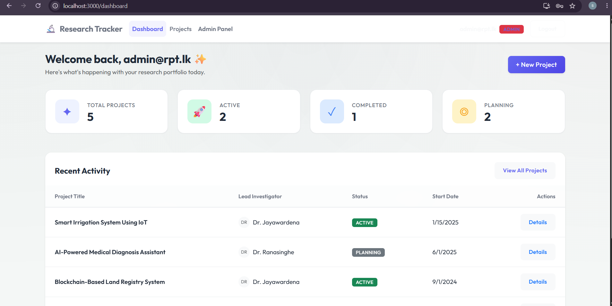
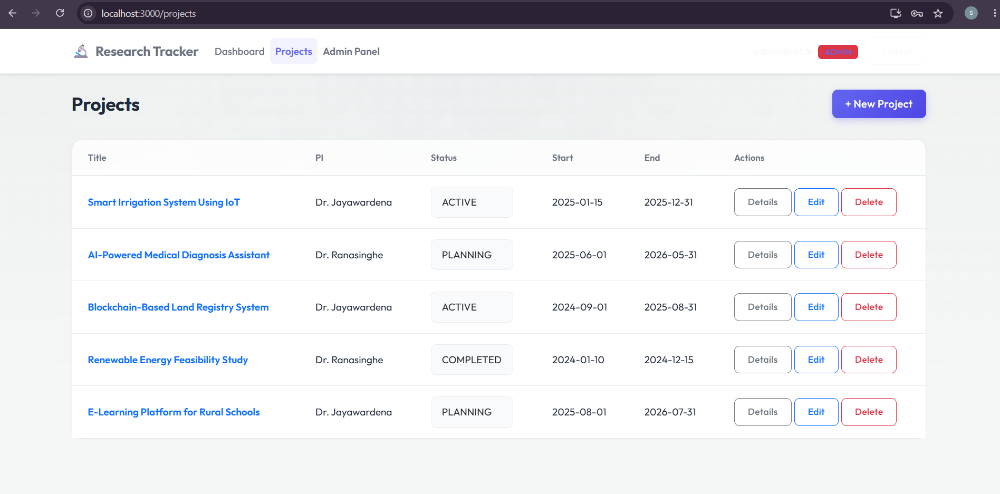
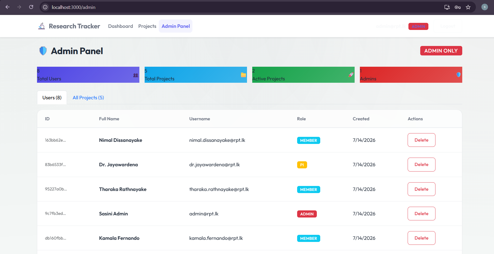

# 🔬 Research Project Tracker — Frontend

A responsive, role-based React + TypeScript single-page application for managing research projects, milestones, and documents. Built as the frontend component of the CMJD Final Project.

---

## 📋 Project Overview

**CMJD Final Project — Front-End Development with React**
Educational Institute: IJSE 
Student: Sasini Siriwardhana | Batch 111
Backend: Spring Boot REST API with JWT authentication

---

## 🛠️ Tech Stack

| Technology | Purpose |
|---|---|
| React 18 (CRA TypeScript) | UI framework |
| TypeScript | Static typing & type safety |
| React Router DOM v6 | Single Page Application navigation |
| Axios | HTTP client with interceptors |
| React Bootstrap 5 | Responsive UI components |
| Context API | Global authentication state management |
| jwt-decode | Decode and validate JWT tokens client-side |

---

## 🚀 Setup & Installation

### Prerequisites
- Node.js ≥ 18
- npm ≥ 9
- Spring Boot backend running on `http://localhost:8081`

### Steps

```bash
# 1. Clone the repository
git clone <repository-url>
cd Research-Tracker-Frontend

# 2. Install dependencies
npm install

# 3. Start the development server
npm start
```

The application will run at `http://localhost:3000`.

### Starting the Backend

Make sure your Spring Boot backend is up and running first:
```bash
cd ../Research-Tracker-Backend
./mvnw spring-boot:run
```

---

## 🔑 Test Credentials

Use the following default credentials to log in and explore the system. You can also import `sample_data.sql` into your MySQL database to get started quickly.

| Role | Username | Password |
|---|---|---|
| **ADMIN** | `admin@rpt.lk` | `Admin@1234` |
| **PI** | `dr.jayawardena@rpt.lk` | `Password@123` |
| **MEMBER** | `nimal.dissanayake@rpt.lk` | `Password@123` |
| **VIEWER** | `observer@rpt.lk` | `Password@123` |

---

## 📁 Project Structure

```
src/
├── components/
│   ├── common/           # Reusable: Spinner, AlertMessage, StatusBadge
│   └── layout/           # AppNavbar
├── context/
│   └── AuthContext.tsx   # JWT auth state + custom hooks
├── interfaces/
│   └── index.ts          # TypeScript interfaces mirroring backend DTOs
├── layouts/
│   └── MainLayout.tsx    # App shell with navbar and outlet
├── pages/
│   ├── auth/             # LoginPage, RegisterPage
│   ├── dashboard/        # DashboardPage
│   ├── projects/         # ProjectsPage, ProjectDetailPage
│   ├── milestones/       # MilestonesPage
│   ├── documents/        # DocumentsPage
│   └── admin/            # AdminPage (ADMIN role only)
├── routes/
│   └── ProtectedRoute.tsx # Route guards: ProtectedRoute, RoleRoute, GuestRoute
├── services/             # Axios-based API service layer
│   ├── axiosInstance.ts  # Base config + auth interceptors
│   ├── authService.ts
│   ├── projectService.ts
│   ├── milestoneService.ts
│   ├── documentService.ts
│   └── userService.ts
└── styles/
    └── global.css        # Global design system & CSS variables
```

---

## 🔒 Authentication Flow

1. User submits credentials → `POST /api/auth/login`
2. Backend returns `{ token, userId, username, role }`
3. Token is stored in `localStorage`
4. Every Axios request automatically attaches `Authorization: Bearer <token>`
5. On 401 Unauthorized response → token is cleared, user is redirected to `/login`
6. JWT expiry is checked client-side on every page load

---

## 🧭 Application Routes

| Path | Component | Access |
|---|---|---|
| `/login` | LoginPage | Public (unauthenticated only) |
| `/register` | RegisterPage | Public (unauthenticated only) |
| `/dashboard` | DashboardPage | All authenticated users |
| `/projects` | ProjectsPage | All authenticated users |
| `/projects/:id` | ProjectDetailPage | All authenticated users |
| `/projects/:id/milestones` | MilestonesPage | All authenticated users |
| `/projects/:id/documents` | DocumentsPage | All authenticated users |
| `/admin` | AdminPage | ADMIN role only |

---

## 📡 Backend API Endpoints

### Authentication
| Method | Endpoint | Description |
|---|---|---|
| POST | `/api/auth/signup` | Register a new user |
| POST | `/api/auth/login` | Login and receive JWT |

### Projects
| Method | Endpoint | Description |
|---|---|---|
| GET | `/api/projects` | List all projects |
| GET | `/api/projects/:id` | Get project by ID |
| POST | `/api/projects` | Create project (ADMIN, PI) |
| PUT | `/api/projects/:id` | Update project (ADMIN, PI) |
| PATCH | `/api/projects/:id/status` | Update project status |
| DELETE | `/api/projects/:id` | Delete project (ADMIN) |

### Milestones
| Method | Endpoint | Description |
|---|---|---|
| GET | `/api/projects/:id/milestones` | List milestones for a project |
| POST | `/api/projects/:id/milestones` | Add a milestone |
| PUT | `/api/milestones/:id` | Update a milestone |
| DELETE | `/api/milestones/:id` | Delete a milestone |

### Documents
| Method | Endpoint | Description |
|---|---|---|
| GET | `/api/projects/:id/documents` | List documents for a project |
| POST | `/api/projects/:id/documents` | Upload a document |
| DELETE | `/api/documents/:id` | Delete a document |

### Users (Admin Only)
| Method | Endpoint | Description |
|---|---|---|
| GET | `/api/users` | List all users |
| GET | `/api/users/:id` | Get user by ID |
| DELETE | `/api/users/:id` | Delete a user |

---

## 🌿 Git Branching Strategy

```
main         ← stable, production-ready code
feat/*       ← individual feature branches
fix/*        ← bug fix branches
```

### Commit Convention
```
feat: add project creation modal
fix: handle 401 token expiry and redirect
refactor: extract StatusBadge component
docs: update README with setup instructions
```

---

## 📸 Screenshots

> 






---

## 👩‍💻 Author

**Sasini Siriwardhana**
Batch 111 | CMJD Final Project
